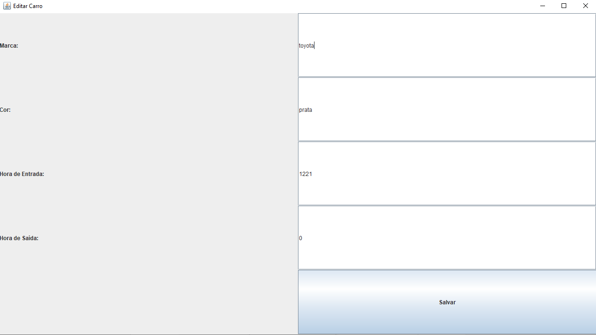

# Controle de Estacionamento

O projeto consiste em um sistema de controle de estacionamento desenvolvido em Java com interface gráfica usando o framework Swing. O objetivo é permitir que o usuário gerencie o cadastro de carros estacionados, incluindo a adição, edição e exclusão de registros.

## Classes Principais

1. **EstacionamentoApp**: Esta é a classe principal que cria a interface gráfica do usuário (GUI). Ela inclui campos de entrada para os dados do carro, como marca, placa, cor e horário de entrada/saída, bem como botões para adicionar carros, exibir carros cadastrados e realizar operações de edição e exclusão.

2. **CarroDAO**: Esta classe é responsável pela comunicação com o banco de dados, incluindo operações como inserção, atualização, exclusão e recuperação de dados de carros estacionados.

3. **EditarCarroFrame**: Esta classe representa uma janela de edição de carro, que é aberta quando o usuário seleciona um carro na tabela e clica no botão "Editar Dados". Ela permite que o usuário edite os detalhes do carro selecionado, como marca, placa, cor e horário de entrada/saída.

## Fluxo de Funcionamento

- O usuário inicia a aplicação.
- Ele pode adicionar novos carros preenchendo os campos na tela principal e clicando no botão "Adicionar Carro".
- Ele pode visualizar os carros cadastrados clicando no botão "Exibir Carros cadastrados", que abre uma nova janela com uma tabela mostrando os detalhes de todos os carros.
- Na tabela de carros cadastrados, o usuário pode selecionar um carro e clicar no botão "Editar Dados" para abrir a janela de edição e fazer alterações nos dados do carro selecionado.
- Ele também pode excluir um carro selecionado na tabela clicando no botão "Excluir Dados".
- Após adicionar, editar ou excluir um carro, os dados na tabela são atualizados automaticamente para refletir as mudanças no banco de dados.

## Integração do Banco de Dados

A integração do banco de dados foi realizada utilizando JDBC (Java Database Connectivity), que é uma API do Java para acessar e manipular bancos de dados relacionais.

No projeto, a classe `CarroDAO` é responsável por toda a interação com o banco de dados. Ela estabelece a conexão com o banco, executa consultas SQL e manipula os resultados obtidos.

Para conectar-se ao banco de dados, foi utilizada a classe `ConexaoBD`, que contém o código para estabelecer a conexão com o banco de dados PostgreSQL. Esta classe é responsável por retornar um objeto `Connection`, que é utilizado pela classe `CarroDAO` para realizar as operações de banco de dados.

Dentro da classe `CarroDAO`, são implementados métodos para realizar operações CRUD (Create, Read, Update, Delete) no banco de dados:

- `inserirCarro`: Insere um novo registro de carro na tabela do banco de dados.
- `listarCarros`: Recupera todos os carros cadastrados no banco de dados e retorna uma lista de objetos `Carro`.
- `getTodosCarros`: Outra forma de obter todos os carros cadastrados, utilizando um `PreparedStatement`.
- `deletarCarro`: Exclui um registro de carro do banco de dados com base na placa fornecida.
- `atualizarCarro`: Atualiza um registro de carro existente no banco de dados.

Esses métodos executam consultas SQL para realizar suas operações no banco de dados, utilizando objetos `PreparedStatement` para inserção, atualização e exclusão de registros, e objetos `ResultSet` para recuperar resultados de consultas de seleção.

A utilização desses métodos na classe `EstacionamentoApp` permite a interação do usuário com o banco de dados por meio da interface gráfica, possibilitando a adição, edição e exclusão de carros estacionados.

### Prints das telas

Tela principal:  
  
Inserção de dados:  
  
  
  
Exibir Carros cadastrados:  
  
Edição de dados de um carro:  
  
  
  
  
  
  
  
Excluir um carro:  
  
  
  
  
